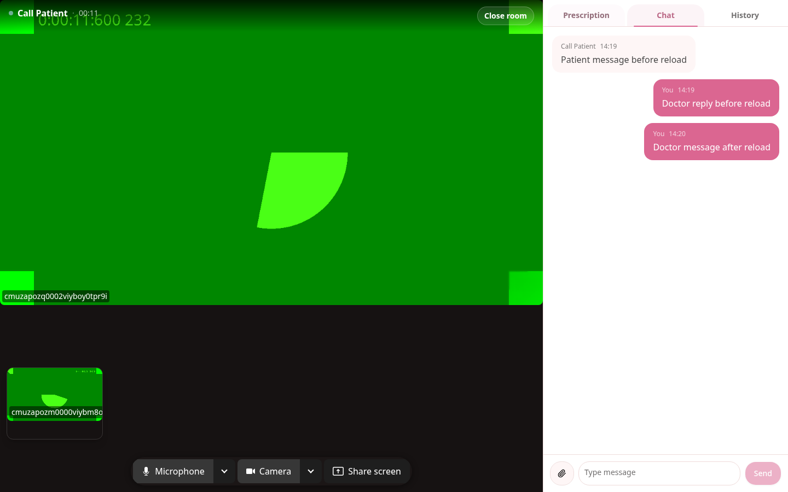
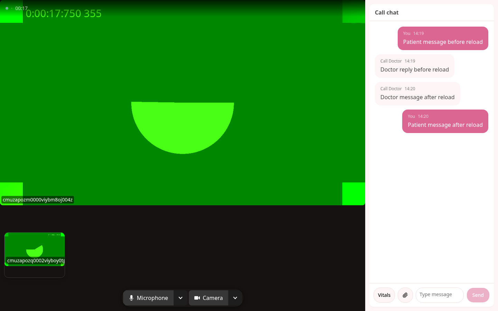
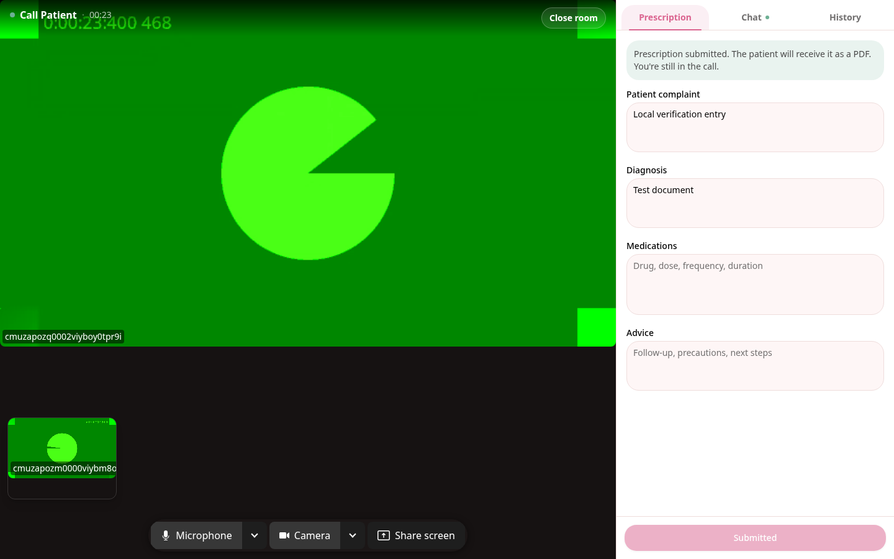
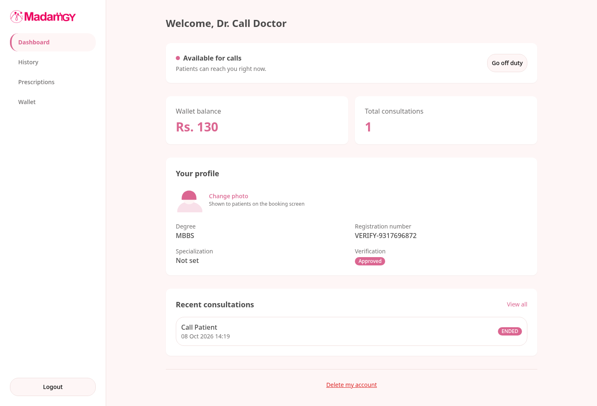

# Upstream call recovery verification

Fresh captures from the upstream-based implementation on 2026-10-08, 08:49:51 to 08:50:25 UTC. Base: `a0c0178bc71bae9d8c6030f45eeb6fbfdf750de5`.

The running doctor and patient pages used separate authenticated Chromium 153.0.8010.12 contexts, real server workers and LiveKit. Chromium used `--use-fake-device-for-media-stream`, `--use-fake-ui-for-media-stream` and a 440 Hz microphone input. These results establish local transport with synthetic media, not physical device quality or remote-network behavior.

Fresh checks passed: 39 web tests in 5 files, 4 affected server consultation-flow tests, typecheck and production build with Vite 8.1.3. The existing bundle-size warning remains. The broader server suite was not repeated for this integration.

The four deferred reconnect regressions failed before the call-ID invalidation fix and pass after it. They cover local clear or switching calls before stale ACTIVE or RINGING snapshots arrive. The suite also covers initial empty-store recovery, navigation during reconnect, role/unmount cleanup, explicit consultation-start intent, pending-bootstrap minimize and incoming-ring resync.

The complete browser flow passed patient minimize before acceptance, doctor ringing-dashboard reload, both active-call reloads, restored chat and new message delivery, a 44,286-byte PDF while the call stayed active, both peers' microphone/camera toggles, hangup and cleanup. All ten peer/stage measurements show increasing inbound/outbound audio/video bytes and packets. Over each 2.5-second interval, encoded video frames increased by 136 to 153 and decoded frames by 51 to 52. Received audio had 54,720 to 57,600 decoded PCM samples per recording, with RMS 0.0195520 to 0.0197073. See [measurements, source hashes and cleanup](metrics.json).

Cleanup asserts exactly one consultation, no active call for either account, doctor availability restored, both dashboards ready, all captured device tracks ended, all peer connections closed and the LiveKit room deleted.

The four screenshots below were inspected directly. The [29.44-second doctor workflow recording](doctor-workflow.mp4) is an H.264 excerpt of the actual browser recording; sampled frames were inspected through reload, prescription and hangup. It has no audio track. Separate received-track recordings preserve audio for the [doctor](initial-doctor-received-audio.webm) and [patient](initial-patient-received-audio.webm). ffmpeg emitted an Opus packet-header warning but exited successfully and decoded nonzero PCM in all ten measurements.

Doctor after reload, with restored chat and a new reply:



Patient after reload, with restored chat and a new message:



PDF ready while the call remains connected:



Doctor available after hangup, with exactly one ended consultation:



Use the [scratch-service setup instructions](../README.md) for disposable Postgres, Redis, MinIO, LiveKit, migrations, environment values and optional Playwright installation. Keep browser resources separate from server tests, including object storage, and run tests before the browser workflow. This run used memory-backed MinIO because disk-backed storage had reached its free-space threshold. No production account or service is required.

Start the server from the repository root:

```fish
npm run dev --workspace @madamgy/server
```

Start the web app in another terminal:

```fish
cd packages/web
node --env-file=../../.env node_modules/vite/bin/vite.js --host 127.0.0.1 --port 5174
```

Then run from the repository root with Node 22+, ffmpeg and Playwright Chromium installed:

```fish
env CALL_VERIFY_SCRATCH=1 CALL_VERIFY_URL=http://localhost:5174 CALL_VERIFY_OUTPUT=data/uploads/call-verification/media-upstream PLAYWRIGHT_MODULE=../data/uploads/call-verification/tools/node_modules/playwright/index.mjs node scripts/verify-call-media.mjs
```

The verifier uses the normal `/login?role=...` pages. `PLAYWRIGHT_MODULE` resolves relative to the verifier script. Choose a fresh output directory to retain previous evidence. A successful run prints `TWO_PEER_CALL_VERIFIED` and saves full reports, screenshots, received audio, both browser recordings and the PDF. Synthetic account records remain in the scratch database for inspection.
